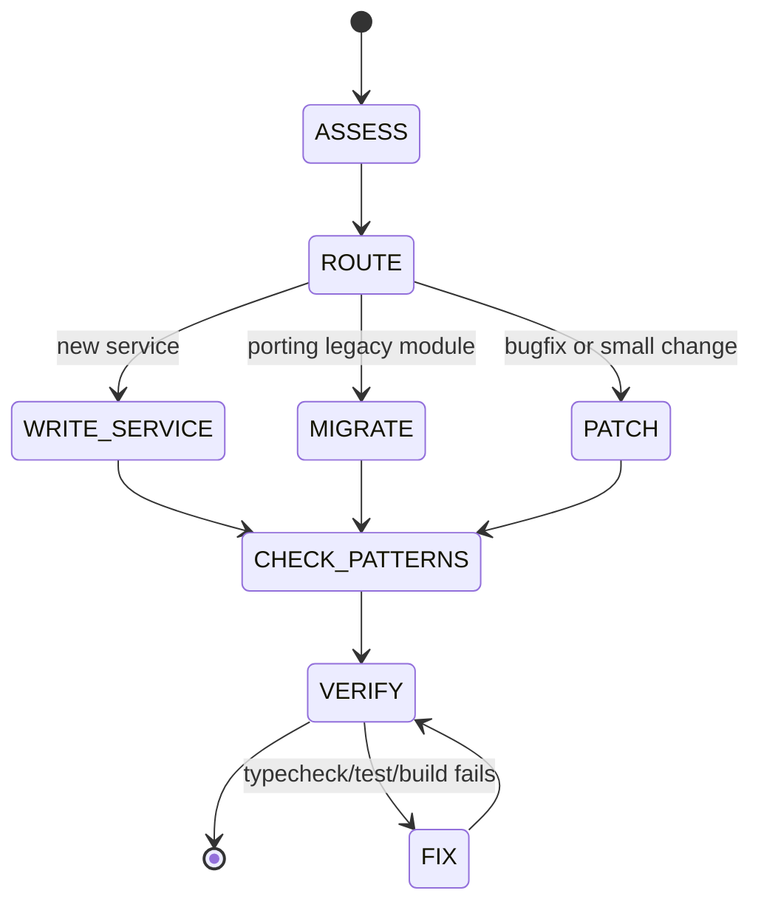

# Guardian Core Coding Standards: Unified Protocol & Specification

This skill is the source of truth for writing TypeScript in Guardian Core. Every new service, feature, bug fix, and refactor must conform to these patterns. The codebase is migrating from async/await to Effect TypeScript — all new code is Effect-first.

## Runtime Policy

- Runtime and package manager is `bun`.
- `npm` is not allowed for install, run, build, test, or script execution.
- Use `bun install`, `bun run <script>`, `bunx <tool>`.

## Taxonomy

Every rule in the reference specifications uses tagged lines:

- `[ASSERTION]`: a predicate that must hold true for the code to be correct.
- `[HAZARD]`: a known pitfall that causes compile errors, runtime exceptions, or silent bugs.
- `[ANTI-PATTERN]`: a practice that must be avoided, with the correct alternative.

### Rule Block Format

```yaml
ETS-XX-NNN:
  predicate: "what must be true"
  on_fail:
    severity: BLOCKER | MAJOR | MINOR
    remediation: "how to fix it"
```

---

## Coding Assessment Loop



### State: ASSESS

```yaml
inputs:
  - task_description: string
  - affected_files: string[]
  - codebase_state: MigrationPhase

operations:
  - INVOKE references/00_operating_mode.md

assertions:
  - ASSERT task_description IS_CLEAR
  - ASSERT affected_files IDENTIFIED

exit_criteria:
  - route: NEW_SERVICE | MIGRATE | PATCH
```

### State: CHECK_PATTERNS

```yaml
inputs:
  - written_code: ChangeSet

operations:
  - PARALLEL:
      - INVOKE references/01_effect_service_pattern.md
      - INVOKE references/02_error_handling.md
      - INVOKE references/03_schema_and_types.md
  - SEQUENTIAL:
      - INVOKE references/04_testing_and_verification.md
      - INVOKE references/06_effect_typescript_hazards.md

outputs:
  - findings: Finding[]
```

### State: VERIFY

```yaml
inputs:
  - written_code: ChangeSet

operations:
  - RUN bun run typecheck
  - RUN bun run test
  - RUN bun run build
  - IF service_migration: RUN bun run dev

assertions:
  - ASSERT typecheck.exit_code == 0
  - ASSERT test.exit_code == 0
  - ASSERT build.exit_code == 0

exit_criteria:
  - all_assertions_pass: true
```

---

## Architecture

```
src/
├── errors.ts                  # All domain errors (Data.TaggedError)
├── schemas.ts                 # All domain types (Effect Schema)
├── AppConfig.ts               # Config service (Context.Tag)
├── AppLogger.ts               # Pino ↔ Effect logger bridge
├── MountSecurityService.ts    # Reference service implementation
├── container-runner.ts        # Legacy code (consumes Effect via wrappers)
├── index.ts                   # Main entry (legacy, migrating last)
└── __tests__/
    └── MountSecurityService.test.ts
```

### Module Conventions

| Convention | Rule |
|-----------|------|
| **Services** | `PascalCase.ts` — e.g. `MountSecurityService.ts`, `DatabaseService.ts` |
| **Legacy modules** | `kebab-case.ts` — e.g. `container-runner.ts`, `mount-security.ts` |
| **Errors** | All in `src/errors.ts`, never scattered across files |
| **Schemas** | All in `src/schemas.ts`, never scattered across files |
| **Tests** | `src/__tests__/ServiceName.test.ts` |
| **Imports** | Use `.js` extension in all imports (NodeNext module resolution) |

---

## Service Pattern (Quick Reference)

Every Effect service follows this five-part structure. See [01_effect_service_pattern.md](references/01_effect_service_pattern.md) for full specification.

```typescript
// 1. Shape interface
export interface FooServiceShape {
  readonly doThing: (input: Input) => Effect.Effect<Output, FooError>;
}

// 2. Context Tag
export class FooService extends Context.Tag('FooService')<
  FooService, FooServiceShape
>() {}

// 3. Implementation
const makeFooService = Effect.gen(function* () {
  const doThing: FooServiceShape['doThing'] = (input) =>
    Effect.gen(function* () { /* ... */ });
  return { doThing } satisfies FooServiceShape;
});

// 4. Layer
export const FooServiceLive = Layer.effect(FooService, makeFooService);

// 5. Legacy wrapper (migration only)
const legacyService = Effect.runSync(makeFooService);
export function doThing(input: Input): Output {
  return Effect.runSync(legacyService.doThing(input));
}
```

---

## Error Handling (Quick Reference)

All errors in `src/errors.ts`. See [02_error_handling.md](references/02_error_handling.md) for full specification.

```typescript
// Define
export class FooError extends Data.TaggedError('FooError')<{
  readonly message: string;
  readonly cause?: unknown;
}> {}

// Fail
return yield* new FooError({ message: 'broke' });

// Wrap sync I/O
yield* Effect.try({
  try: () => fs.readFileSync(path, 'utf-8'),
  catch: (err) => new FileReadError({ path, message: String(err), cause: err }),
});

// Recover
yield* someEffect.pipe(Effect.catchTag('FooError', (e) => Effect.succeed(alt)));
```

---

## Schemas (Quick Reference)

All types in `src/schemas.ts`. See [03_schema_and_types.md](references/03_schema_and_types.md) for full specification.

```typescript
export const Foo = Schema.Struct({
  name: Schema.String,
  status: Schema.Literal('active', 'paused'),
  items: Schema.Array(Schema.String),
  optional: Schema.optional(Schema.String),
  nullable: Schema.NullOr(Schema.String),
});
export type Foo = typeof Foo.Type;
```

---

## Testing (Quick Reference)

See [04_testing_and_verification.md](references/04_testing_and_verification.md) for full specification.

```typescript
import { Effect } from 'effect';
import { describe, expect, it, vi, beforeEach } from 'vitest';
import { FooService, FooServiceLive } from '../FooService.js';

describe('FooService', () => {
  beforeEach(() => { vi.clearAllMocks(); });

  it('should do the thing', () => {
    const program = Effect.gen(function* () {
      const service = yield* FooService;
      return yield* service.doThing(input);
    });
    const result = Effect.runSync(program.pipe(Effect.provide(FooServiceLive)));
    expect(result).toEqual(expected);
  });
});
```

---

## Migration Protocol (Quick Reference)

See [05_migration_protocol.md](references/05_migration_protocol.md) for full specification.

```
1. Create FooBarService.ts (service pattern)
2. Add errors to src/errors.ts
3. Add schemas to src/schemas.ts
4. Export legacy wrappers (same signatures)
5. Update importers (change import path only)
6. Write tests in src/__tests__/
7. Verify: bun run typecheck && bun run test && bun run build
8. Do NOT delete old module until Phase 6
```

### Migration Phase Map

| Phase | Modules | Status |
|-------|---------|--------|
| 1 - Foundation | errors, schemas, AppConfig, AppLogger, MountSecurityService | Complete |
| 2 - Database | DatabaseService (wraps better-sqlite3) | Pending |
| 3 - I/O Services | ContainerService, PhoneCallerService | Pending |
| 4 - Orchestration | IpcService, SchedulerService | Pending |
| 5 - Entry | WhatsAppService, MainLive | Pending |
| 6 - Cleanup | Delete legacy modules, remove wrappers, drop zod | Pending |

---

## Hazard Catalog (Quick Reference)

See [06_effect_typescript_hazards.md](references/06_effect_typescript_hazards.md) for full catalog.

| ID | Hazard | Severity |
|----|--------|----------|
| HAZ-001 | `return new TaggedError()` without `yield*` — succeeds with error as value | BLOCKER |
| HAZ-002 | `string[]` param rejects Schema's `readonly string[]` | BLOCKER |
| HAZ-003 | `LogLevel.fromLiteral` needs literal union cast | MAJOR |
| HAZ-004 | Missing `yield*` in `Effect.gen` — gets Effect wrapper not value | BLOCKER |
| HAZ-005 | `Effect.try` catch throws instead of returning error | BLOCKER |
| HAZ-006 | Missing `.js` extension in ESM imports | BLOCKER |
| HAZ-007 | Pino logger needs double-cast through `unknown` | MINOR |
| HAZ-008 | `@effect/vitest` strict peer deps on effect + vitest versions | MAJOR |
| HAZ-009 | ESM mocking requires both default and named export mocks | MAJOR |
| HAZ-010 | `Effect.runSync` on async effects throws `AsyncFiberException` | BLOCKER |

---

## Anti-Pattern Quick Reference

| Anti-Pattern | Correct Pattern |
|-------------|----------------|
| `throw new Error(...)` in Effect code | `yield* new TaggedError(...)` |
| `try/catch` blocks inside `Effect.gen` | `Effect.try` / `Effect.tryPromise` |
| `Promise`-based code in new services | `Effect.tryPromise` or `Effect.async` |
| `any` type | `unknown` + runtime validation via Schema |
| Mutable module-level `let` for state | `Ref<T>` |
| `process.env` in service code | `yield* AppConfig` |
| Errors defined in service files | All errors in `src/errors.ts` |
| Schemas defined in service files | All schemas in `src/schemas.ts` |
| `interface Foo { ... }` for data shapes | `Schema.Struct({ ... })` + `typeof Foo.Type` |
| `setTimeout` loops | `Effect.repeat(Schedule.spaced(...))` |
| Manual retry logic | `Effect.retry(Schedule.exponential(...))` |
| `process.exit()` | `Effect.interrupt` or let the runtime shut down |

---

## Verification Checklist

Before any PR:

```bash
bun run typecheck   # Zero errors
bun run test            # All tests pass
bun run build       # Clean compilation
```

For service migrations, also:

```bash
bun run dev         # App starts, processes messages normally
```

---

## Logic Module Index

| Module | File | Domain |
|--------|------|--------|
| ETS-00 | [00_operating_mode.md](references/00_operating_mode.md) | Coding posture & routing |
| ETS-01 | [01_effect_service_pattern.md](references/01_effect_service_pattern.md) | Service architecture |
| ETS-02 | [02_error_handling.md](references/02_error_handling.md) | Failure semantics |
| ETS-03 | [03_schema_and_types.md](references/03_schema_and_types.md) | Data modeling |
| ETS-04 | [04_testing_and_verification.md](references/04_testing_and_verification.md) | Testing standards |
| ETS-05 | [05_migration_protocol.md](references/05_migration_protocol.md) | Legacy → Effect migration |
| ETS-06 | [06_effect_typescript_hazards.md](references/06_effect_typescript_hazards.md) | Hazard catalog |
