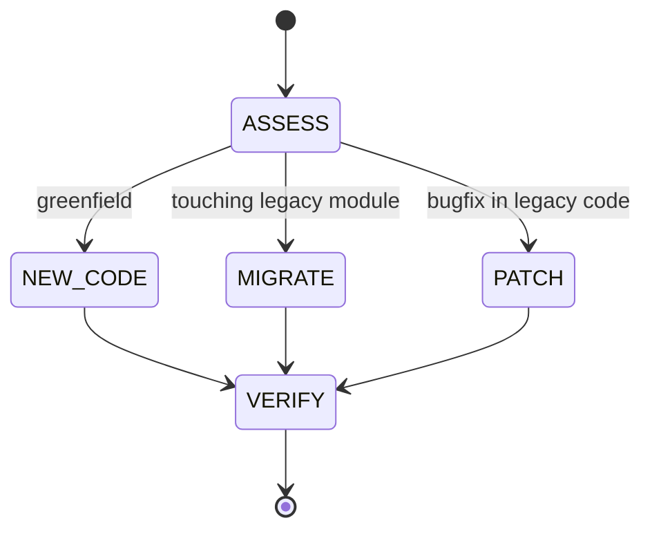

# Operating Mode

```yaml
module_id: ETS-00
domain: coding_posture
inputs: [Task, CodebaseState]
outputs: [CodingConfig]
```

## Posture

This codebase is mid-migration from async/await TypeScript to Effect TypeScript. Every coding action must respect both the old world (legacy modules) and the new world (Effect services) simultaneously.



## Decision Rules

### New Code

All new functionality is Effect-first. No exceptions.

```yaml
assertions:
  ETS-00-001:
    predicate: "New service file uses Context.Tag + Layer + Effect.gen pattern"
    on_fail:
      severity: BLOCKER
      remediation: "Rewrite as Effect service per 01_effect_service_pattern.md"

  ETS-00-002:
    predicate: "New errors added to src/errors.ts, not defined locally"
    on_fail:
      severity: MAJOR
      remediation: "Move error definitions to src/errors.ts"

  ETS-00-003:
    predicate: "New data shapes added to src/schemas.ts using Effect Schema"
    on_fail:
      severity: MAJOR
      remediation: "Move type definitions to src/schemas.ts as Effect Schema"
```

### Migrating Legacy Code

When touching a legacy module substantially (>30% of lines changed), migrate it fully.

```yaml
assertions:
  ETS-00-010:
    predicate: "Migration exports legacy wrappers with identical signatures"
    on_fail:
      severity: BLOCKER
      remediation: "Add wrapper functions matching old API. See 04_migration_protocol.md"

  ETS-00-011:
    predicate: "Callers only change their import path, not call signatures"
    on_fail:
      severity: BLOCKER
      remediation: "Legacy wrapper signature must match the old module exactly"
```

### Patching Legacy Code

Small bugfixes in legacy modules are acceptable without full migration.

```yaml
assertions:
  ETS-00-020:
    predicate: "Patch does not introduce new untyped errors (throw new Error)"
    on_fail:
      severity: MINOR
      remediation: "Consider using tagged errors if the module will be migrated soon"
```

## Trust Model

- Compiler output (`tsc --noEmit`) is authoritative for type safety.
- Test output (`vitest run`) is authoritative for behavioral correctness.
- Runtime verification (`bun run dev` + trigger a message) is authoritative for integration correctness.
- Comments and docs are non-binding — only code and tests prove correctness.

## Verification Gate

Every change must pass before merge:

```bash
bun run typecheck   # Zero errors
bun run test            # All tests pass
bun run build       # Clean compilation
```

For service migrations, also:

```bash
bun run dev         # App starts and processes messages
```
