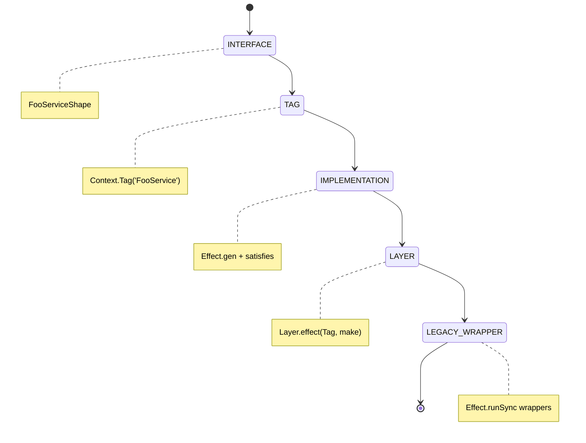

# Effect Service Pattern

```yaml
module_id: ETS-01
domain: service_architecture
inputs: [ServiceRequirements, DomainErrors, DomainSchemas]
outputs: [Finding[]]
```

## Canonical Service Structure

Every Effect service in Guardian Core follows this exact five-part structure. `MountSecurityService.ts` is the reference implementation.



## Part 1: Shape Interface

```typescript
export interface FooServiceShape {
  readonly doThing: (input: Input) => Effect.Effect<Output, FooError>;
  readonly loadData: Effect.Effect<Data, LoadError>;
}
```

```yaml
assertions:
  ETS-01-001:
    predicate: "Shape interface is exported and named {Service}Shape"
    on_fail:
      severity: MAJOR
      remediation: "Extract interface, name it FooServiceShape"

  ETS-01-002:
    predicate: "All methods have explicit error types in Effect.Effect<A, E>"
    on_fail:
      severity: BLOCKER
      remediation: "Never use unknown or omit the error channel for fallible operations"

  ETS-01-003:
    predicate: "Success-only operations use Effect.Effect<A> (E = never)"
    on_fail:
      severity: MINOR
      remediation: "Remove error type parameter for infallible operations"

  ETS-01-004:
    predicate: "All fields are readonly"
    on_fail:
      severity: MINOR
      remediation: "Add readonly modifier to all interface fields"
```

## Part 2: Context Tag

```typescript
export class FooService extends Context.Tag('FooService')<
  FooService,
  FooServiceShape
>() {}
```

```yaml
assertions:
  ETS-01-010:
    predicate: "Tag string matches class name exactly"
    on_fail:
      severity: MAJOR
      remediation: "Context.Tag('FooService') must match class FooService"

  ETS-01-011:
    predicate: "Tag references the Shape interface, not inline types"
    on_fail:
      severity: MINOR
      remediation: "Use FooServiceShape as the type parameter"
```

## Part 3: Implementation

```typescript
const makeFooService = Effect.gen(function* () {
  // Acquire dependencies (ports)
  const config = yield* AppConfig;
  const clock = yield* Clock.Clock;
  const fileSystem = yield* FileSystem;  // Only for services that need testable file I/O

  // Clock helpers (sync, safe inside Effect.try)
  const getNowIso = (): string => new Date(clock.unsafeCurrentTimeMillis()).toISOString();
  const getNowMs = (): number => clock.unsafeCurrentTimeMillis();

  // Initialize state
  const cache = yield* Ref.make<CacheType | null>(null);

  // Define methods (annotated against shape)
  const doThing: FooServiceShape['doThing'] = (input) =>
    Effect.gen(function* () { /* ... */ });

  const loadData: FooServiceShape['loadData'] = Effect.gen(function* () {
    /* ... */
  });

  return { doThing, loadData } satisfies FooServiceShape;
});
```

```yaml
assertions:
  ETS-01-020:
    predicate: "Implementation function is named make{Service}"
    on_fail:
      severity: MINOR
      remediation: "Rename to makeFooService"

  ETS-01-021:
    predicate: "Each method is annotated with FooServiceShape['methodName']"
    on_fail:
      severity: MAJOR
      remediation: "Type annotation catches signature drift at compile time"

  ETS-01-022:
    predicate: "Return object uses satisfies FooServiceShape"
    on_fail:
      severity: MAJOR
      remediation: "satisfies catches missing methods and type mismatches"

  ETS-01-023:
    predicate: "Mutable state uses Ref<T>, not module-level let"
    on_fail:
      severity: BLOCKER
      remediation: "Replace let cache = ... with yield* Ref.make<T>(initial)"

  ETS-01-024:
    predicate: "Dependencies acquired via yield* Tag, not direct imports"
    on_fail:
      severity: MAJOR
      remediation: "Use yield* AppConfig instead of importing config.ts directly"
      note: "Exception: during migration, pure helpers may use direct imports"
```

## Part 4: Layer Export

```typescript
export const FooServiceLive = Layer.effect(FooService, makeFooService);
```

```yaml
assertions:
  ETS-01-030:
    predicate: "Layer is named {Service}Live"
    on_fail:
      severity: MINOR
      remediation: "Follow naming convention: FooServiceLive"

  ETS-01-031:
    predicate: "Layer uses Layer.effect for services with state/deps, Layer.succeed for pure services"
    on_fail:
      severity: MINOR
      remediation: "Layer.succeed for stateless config, Layer.effect for services with Ref or deps"
```

## Part 5: Legacy Wrappers (Migration Phase Only)

```typescript
const legacyService = Effect.runSync(makeFooService);

export function doThing(input: Input): Output {
  return Effect.runSync(legacyService.doThing(input));
}
```

```yaml
assertions:
  ETS-01-040:
    predicate: "Legacy wrapper signature matches old module function exactly"
    on_fail:
      severity: BLOCKER
      remediation: "Callers must be able to change only the import path"

  ETS-01-041:
    predicate: "Effect.runSync for sync operations, Effect.runPromise for async"
    on_fail:
      severity: BLOCKER
      remediation: "Mismatched run mode will throw or return Promise unexpectedly"

  ETS-01-042:
    predicate: "Legacy wrappers are clearly marked with a section comment"
    on_fail:
      severity: MINOR
      remediation: "Add: // --- Legacy wrappers (drop-in replacement for foo.ts exports) ---"
```

## Pure Helpers

Pure functions that don't need Effect (string manipulation, path resolution, math) live as plain functions within the service file.

```yaml
assertions:
  ETS-01-050:
    predicate: "Pure helpers are not exported (private to the file)"
    on_fail:
      severity: MINOR
      remediation: "Only the service Tag, Layer, Shape, and legacy wrappers are exported"

  ETS-01-051:
    predicate: "Pure helpers accept readonly arrays from Schema types"
    on_fail:
      severity: BLOCKER
      remediation: "Use readonly T[] in parameters. Schema arrays are readonly."
```

## File Organization

Within a service file, sections appear in this order:

1. Imports
2. Constants
3. Pure helpers
4. Service interface (`FooServiceShape`)
5. Context Tag (`FooService`)
6. Implementation (`makeFooService`)
7. Layer export (`FooServiceLive`)
8. Legacy wrappers (if applicable)
