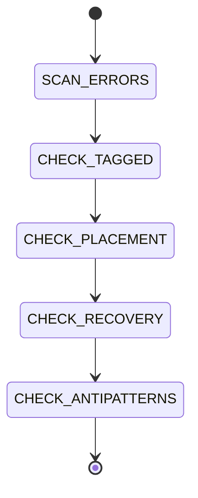

# Error Handling

```yaml
module_id: ETS-02
domain: failure_semantics
inputs: [ChangeSetBundle, ErrorDefinitions]
outputs: [Finding[]]
```

## Review Protocol



## Tagged Error Structure

All domain errors live in `src/errors.ts`.

```typescript
export class FooError extends Data.TaggedError('FooError')<{
  readonly message: string;
  readonly cause?: unknown;
}> {}
```

```yaml
assertions:
  ETS-02-001:
    predicate: "Tag string matches class name exactly"
    on_fail:
      severity: MAJOR
      remediation: "Data.TaggedError('FooError') for class FooError"

  ETS-02-002:
    predicate: "All fields are readonly"
    on_fail:
      severity: MINOR
      remediation: "Add readonly modifier"

  ETS-02-003:
    predicate: "Error includes domain context fields (path, group, operation)"
    on_fail:
      severity: MINOR
      remediation: "Add fields that help identify what went wrong and where"

  ETS-02-004:
    predicate: "Errors wrapping external exceptions include cause?: unknown"
    on_fail:
      severity: MINOR
      remediation: "Add cause field to preserve the original exception for debugging"

  ETS-02-005:
    predicate: "Error is defined in src/errors.ts, not in the service file"
    on_fail:
      severity: MAJOR
      remediation: "Move to src/errors.ts. All errors are centralized."

  ETS-02-006:
    predicate: "Errors are grouped by domain with section comments"
    on_fail:
      severity: MINOR
      remediation: "Add: // --- Database errors ---, // --- Container errors ---, etc."
```

## Failing in Effect.gen

```yaml
assertions:
  ETS-02-010:
    predicate: "Errors are yielded, not returned: yield* new FooError(...)"
    on_fail:
      severity: BLOCKER
      remediation: |
        WRONG: return new FooError({ message: 'broke' })
        This succeeds with the error as a value.

        CORRECT: return yield* new FooError({ message: 'broke' })
        This fails the Effect with the error.

  ETS-02-011:
    predicate: "No throw statements inside Effect.gen"
    on_fail:
      severity: BLOCKER
      remediation: "Use yield* new TaggedError(...) instead of throw"
```

## Wrapping External Exceptions

```yaml
assertions:
  ETS-02-020:
    predicate: "Sync external calls use Effect.try"
    on_fail:
      severity: MAJOR
      remediation: |
        yield* Effect.try({
          try: () => fs.readFileSync(path, 'utf-8'),
          catch: (err) => new FileReadError({ path, message: String(err), cause: err }),
        });

  ETS-02-021:
    predicate: "Async external calls use Effect.tryPromise"
    on_fail:
      severity: MAJOR
      remediation: |
        yield* Effect.tryPromise({
          try: () => fetch(url),
          catch: (err) => new FooApiError({ message: String(err), cause: err }),
        });

  ETS-02-022:
    predicate: "Effect.try catch returns the error, does not throw it"
    on_fail:
      severity: BLOCKER
      remediation: "catch: (err) => new MyError(...) — return, don't throw"

  ETS-02-023:
    predicate: "Error message extracts string from cause: err instanceof Error ? err.message : String(err)"
    on_fail:
      severity: MINOR
      remediation: "Normalize error messages for consistent logging"
```

## Error Recovery Patterns

### Pattern: Fallback Value

```typescript
const result = yield* someEffect.pipe(
  Effect.catchAll(() => Effect.succeed(fallbackValue)),
);
```

### Pattern: Catch Specific Tag

```typescript
const result = yield* someEffect.pipe(
  Effect.catchTag('FooError', (e) => Effect.succeed(alternative)),
);
```

### Pattern: Error as Value (for branching)

```typescript
const either = yield* Effect.either(someEffect);
if (either._tag === 'Left') {
  // branch on failure
}
```

```yaml
assertions:
  ETS-02-030:
    predicate: "Silent error swallowing is avoided"
    on_fail:
      severity: MAJOR
      remediation: "At minimum, log the error before returning a fallback"

  ETS-02-031:
    predicate: "Effect.catchAll is used only when the fallback is meaningful"
    on_fail:
      severity: MINOR
      remediation: "Don't catch errors just to suppress them. Let them propagate if the caller needs to know."
```

## Panic / Unrecoverable Failure Policy

```yaml
assertions:
  ETS-02-040:
    predicate: "No process.exit() in Effect code"
    on_fail:
      severity: BLOCKER
      remediation: "Use Effect.interrupt or let the runtime handle shutdown"

  ETS-02-041:
    predicate: "No throw in Effect code paths"
    on_fail:
      severity: BLOCKER
      remediation: "Use tagged errors for all failure modes"

  ETS-02-042:
    predicate: "Unrecoverable errors (corrupt state, missing infrastructure) may use Effect.die"
    on_fail:
      severity: MINOR
      remediation: "Effect.die is acceptable for truly impossible states (defects)"
```

## Error Taxonomy

| Domain | Error Types | When |
|--------|-------------|------|
| Config | `ConfigError` | Missing or invalid configuration |
| Database | `DatabaseInitError`, `DatabaseQueryError` | SQLite failures |
| Container | `ContainerSpawnError`, `ContainerTimeoutError`, `ContainerOutputParseError`, `ContainerExitError` | Docker lifecycle |
| Mount Security | `MountAllowlistNotFoundError`, `MountAllowlistParseError`, `MountValidationError` | Mount validation |
| WhatsApp | `WhatsAppConnectionError`, `WhatsAppSendError` | Connection and messaging |
| Phone Caller | `PhoneCallerConfigError`, `PhoneCallerApiError` | Voice call API |
| IPC | `IpcReadError`, `IpcParseError`, `IpcAuthorizationError` | Inter-process communication |
| File I/O | `FileReadError`, `FileWriteError` | General file operations |

When adding a new domain, add all plausible error types at once. It's cheaper to define them upfront than to add them piecemeal.
