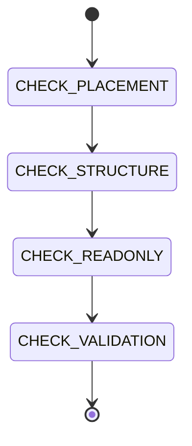

# Schema & Types

```yaml
module_id: ETS-03
domain: data_modeling
inputs: [ChangeSetBundle, ExistingSchemas]
outputs: [Finding[]]
```

## Review Protocol



## Schema Definition

All domain types live in `src/schemas.ts` using Effect Schema.

```typescript
export const Foo = Schema.Struct({
  name: Schema.String,
  count: Schema.Number,
  status: Schema.Literal('active', 'paused'),
  items: Schema.Array(Schema.String),
  optional: Schema.optional(Schema.String),
  nullable: Schema.NullOr(Schema.String),
  nested: Schema.optional(BarSchema),
});
export type Foo = typeof Foo.Type;
```

```yaml
assertions:
  ETS-03-001:
    predicate: "Schema is defined in src/schemas.ts"
    on_fail:
      severity: MAJOR
      remediation: "Move to src/schemas.ts. All schemas are centralized."

  ETS-03-002:
    predicate: "Type is derived with typeof Foo.Type, not a separate interface"
    on_fail:
      severity: MAJOR
      remediation: |
        WRONG: export interface Foo { name: string; count: number; }
        CORRECT: export type Foo = typeof Foo.Type;

        Dual definitions drift. Schema is the single source of truth.

  ETS-03-003:
    predicate: "Schema and type share the same name"
    on_fail:
      severity: MINOR
      remediation: "export const Foo = Schema.Struct({...}); export type Foo = typeof Foo.Type;"

  ETS-03-004:
    predicate: "Schemas are grouped by domain with section comments"
    on_fail:
      severity: MINOR
      remediation: "Add: // --- Mount Security ---, // --- Container ---, etc."
```

## Schema Combinators

| Need | Combinator | Example |
|------|-----------|---------|
| Required field | `Schema.String`, `Schema.Number`, `Schema.Boolean` | `name: Schema.String` |
| Optional field | `Schema.optional(Schema.T)` | `description: Schema.optional(Schema.String)` |
| Nullable field | `Schema.NullOr(Schema.T)` | `last_run: Schema.NullOr(Schema.String)` |
| String union | `Schema.Literal('a', 'b', 'c')` | `status: Schema.Literal('active', 'paused')` |
| Array | `Schema.Array(Schema.T)` | `items: Schema.Array(Schema.String)` |
| Nested struct | Direct reference | `config: Schema.optional(ContainerConfig)` |
| Record/map | `Schema.Record(...)` | `env: Schema.Record({ key: Schema.String, value: Schema.String })` |

## Readonly Arrays

Effect Schema produces `readonly` arrays. This is the most common TypeScript gotcha in this codebase.

```yaml
assertions:
  ETS-03-010:
    predicate: "Functions accepting Schema-derived arrays use readonly T[]"
    on_fail:
      severity: BLOCKER
      remediation: |
        WRONG:  function process(items: string[]): void
        CORRECT: function process(items: readonly string[]): void

        Schema.Array produces readonly arrays. Mutable array params reject them.

  ETS-03-011:
    predicate: "Spreading readonly arrays creates mutable copies when needed"
    on_fail:
      severity: MINOR
      remediation: |
        When you need a mutable array from a readonly source:
        const mutable = [...readonlyArray];
```

## Runtime Validation

External input (files, network, IPC) must be validated through Schema.

```yaml
assertions:
  ETS-03-020:
    predicate: "External JSON is decoded with Schema.decodeUnknownSync"
    on_fail:
      severity: MAJOR
      remediation: |
        const decoded = yield* Effect.try({
          try: () => Schema.decodeUnknownSync(FooSchema)(parsed),
          catch: (err) => new ParseError({ message: String(err), cause: err }),
        });

  ETS-03-021:
    predicate: "JSON.parse result is typed as unknown, not cast with as"
    on_fail:
      severity: MAJOR
      remediation: "JSON.parse(raw) as unknown — then validate through Schema"

  ETS-03-022:
    predicate: "Internal data (already validated) does not re-validate"
    on_fail:
      severity: MINOR
      remediation: "Only validate at system boundaries. Internal service calls trust types."
```

## Legacy Types

`src/types.ts` contains the old `interface`-based types. During migration:

- New code uses Schema types from `src/schemas.ts`.
- Legacy code continues using `src/types.ts`.
- Legacy wrappers accept both (Schema types are structurally compatible).
- `types.ts` is deleted in Phase 6 when all callers are migrated.

```yaml
assertions:
  ETS-03-030:
    predicate: "New code never imports from types.ts"
    on_fail:
      severity: MAJOR
      remediation: "Import from schemas.ts instead"

  ETS-03-031:
    predicate: "Schema types are structurally compatible with legacy interfaces"
    on_fail:
      severity: BLOCKER
      remediation: "Legacy wrappers must work with both old and new callers"
```
