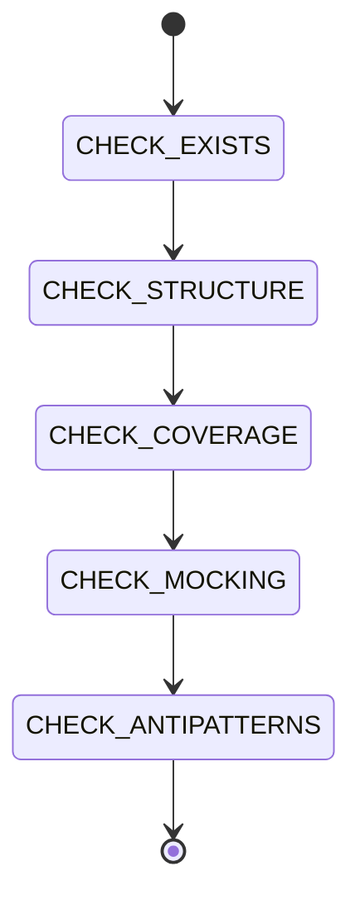

# Testing & Verification

```yaml
module_id: ETS-04
domain: verification
inputs: [ChangeSetBundle, ServiceDefinitions]
outputs: [Finding[]]
```

## Review Protocol



## Test File Structure

Tests live in `src/__tests__/ServiceName.test.ts`.

```typescript
import { Effect } from 'effect';
import { describe, expect, it, vi, beforeEach } from 'vitest';
import { FooService, FooServiceLive } from '../FooService.js';

describe('FooService', () => {
  beforeEach(() => {
    vi.clearAllMocks();
  });

  describe('methodName', () => {
    it('should do the expected thing', () => {
      const program = Effect.gen(function* () {
        const service = yield* FooService;
        return yield* service.methodName(input);
      });

      const result = Effect.runSync(
        program.pipe(Effect.provide(FooServiceLive)),
      );

      expect(result).toEqual(expected);
    });
  });
});
```

```yaml
assertions:
  ETS-04-001:
    predicate: "Every Effect service has a corresponding test file"
    on_fail:
      severity: BLOCKER
      remediation: "Create src/__tests__/FooService.test.ts"

  ETS-04-002:
    predicate: "Tests use vitest + Effect.runSync/Effect.runSyncExit"
    on_fail:
      severity: MAJOR
      remediation: "Use vitest describe/it/expect with Effect.runSync for execution"

  ETS-04-003:
    predicate: "Tests provide the service layer with Effect.provide(FooServiceLive)"
    on_fail:
      severity: MAJOR
      remediation: "All Effect programs need their dependencies provided"

  ETS-04-004:
    predicate: "beforeEach calls vi.clearAllMocks()"
    on_fail:
      severity: MINOR
      remediation: "Prevent test pollution from mock state leaking between tests"
```

## Test Coverage Requirements

```yaml
assertions:
  ETS-04-010:
    predicate: "Happy path is tested for each public method"
    on_fail:
      severity: BLOCKER
      remediation: "Test the normal success case"

  ETS-04-011:
    predicate: "Each error type in the method signature has a failure test"
    on_fail:
      severity: MAJOR
      remediation: |
        it('should fail with FooError when ...', () => {
          const result = Effect.runSyncExit(
            program.pipe(Effect.provide(FooServiceLive)),
          );
          expect(result._tag).toBe('Failure');
        });

  ETS-04-012:
    predicate: "Edge cases are tested (empty input, null, boundary values)"
    on_fail:
      severity: MINOR
      remediation: "Add tests for empty arrays, missing optional fields, etc."

  ETS-04-013:
    predicate: "Security-relevant behavior has negative tests"
    on_fail:
      severity: MAJOR
      remediation: "Test that blocked paths are rejected, invalid input is refused, etc."
```

## Mocking Strategy

Mock at the module boundary (Node.js APIs, external services), not at the Effect service layer.

```typescript
// Mock the fs module
vi.mock('fs', async () => {
  const actual = await vi.importActual<typeof fs>('fs');
  return {
    ...actual,
    default: {
      ...actual,
      existsSync: vi.fn(),
      readFileSync: vi.fn(),
      realpathSync: vi.fn(),
    },
    existsSync: vi.fn(),
    readFileSync: vi.fn(),
    realpathSync: vi.fn(),
  };
});

const mockFs = vi.mocked(fs);
```

```yaml
assertions:
  ETS-04-020:
    predicate: "Mocks target Node.js APIs (fs, child_process, fetch), not Effect services"
    on_fail:
      severity: MAJOR
      remediation: "Mock the boundary, not the service. Services are tested via their real Layer."

  ETS-04-021:
    predicate: "ESM mock pattern: mock both default and named exports"
    on_fail:
      severity: BLOCKER
      remediation: |
        With ESM, you must mock both paths:
        return { ...actual, default: { ...actual, fn: vi.fn() }, fn: vi.fn() };

  ETS-04-022:
    predicate: "Helper function creates common mock setups"
    on_fail:
      severity: MINOR
      remediation: |
        function setupMocks(options: MockOptions) { ... }
        Reduces boilerplate and makes test intent clear.
```

## Test Layers

For integration tests or tests needing service substitution:

```typescript
const TestFooService = Layer.succeed(FooService, {
  doThing: () => Effect.succeed(mockResult),
  loadData: Effect.succeed(mockData),
});

// Use in tests
const result = Effect.runSync(
  program.pipe(Effect.provide(TestFooService)),
);
```

```yaml
assertions:
  ETS-04-030:
    predicate: "Test layers satisfy the full service shape"
    on_fail:
      severity: MAJOR
      remediation: "Test layer must implement all methods from FooServiceShape"
```

## Anti-Patterns

```yaml
anti_patterns:
  ETS-04-AP-001:
    pattern: "Test only asserts no throw / no error"
    severity: MAJOR
    remediation: "Assert on the actual return value, not just absence of failure"

  ETS-04-AP-002:
    pattern: "Test duplicates implementation logic"
    severity: MAJOR
    remediation: "Tests should verify behavior, not re-derive the expected output"

  ETS-04-AP-003:
    pattern: "Test uses Effect.runPromise when Effect.runSync suffices"
    severity: MINOR
    remediation: "Use runSync for synchronous services. Simpler and catches accidental async."

  ETS-04-AP-004:
    pattern: "Test mocks the Effect service instead of the I/O boundary"
    severity: MAJOR
    remediation: "Mock fs/fetch/spawn, not the Effect Tag. Test the real service implementation."

  ETS-04-AP-005:
    pattern: "Test has no assertions"
    severity: BLOCKER
    remediation: "Every test must have at least one expect() call"
```

## Vitest Configuration

```typescript
// vitest.config.ts
import { defineConfig } from 'vitest/config';

export default defineConfig({
  test: {
    include: ['src/__tests__/**/*.test.ts'],
  },
});
```

```yaml
assertions:
  ETS-04-040:
    predicate: "vitest.config.ts exists at project root"
    on_fail:
      severity: BLOCKER
      remediation: "Create vitest.config.ts with test include pattern"

  ETS-04-041:
    predicate: "package.json has test and test:watch scripts"
    on_fail:
      severity: MAJOR
      remediation: |
        "test": "vitest run",
        "test:watch": "vitest"
```
