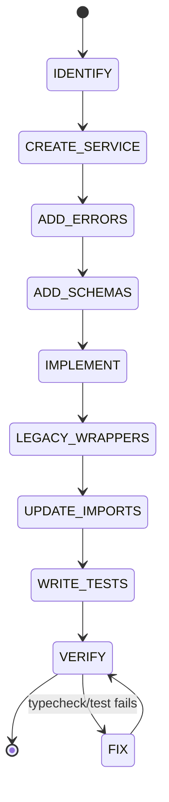

# Migration Protocol

```yaml
module_id: ETS-05
domain: migration
inputs: [LegacyModule, MigrationPhase]
outputs: [Finding[]]
```

## Migration Flow



## Phase Map

| Phase | Modules | Status |
|-------|---------|--------|
| 1 - Foundation | errors, schemas, AppConfig, AppLogger, MountSecurityService | Complete |
| 2 - Services | DatabaseService, ContainerRunnerService, PhoneCallerService, TaskSchedulerService | Complete |
| 3 - Legacy Cleanup | Deleted config.ts, logger.ts, types.ts, utils.ts; consolidated imports | Complete |
| 3.5 - Hexagonal | Clock, Option, Either, Brand types, Duration across all services | Complete |
| 4 - Entry | WhatsAppService, MainLive | Pending |
| 5 - Cleanup | Remove legacy wrappers, full Layer composition | Pending |

## Step-by-Step Protocol

### Step 1: Identify the Module

Read the legacy module. Catalog:
- All exported functions and their signatures.
- All error conditions (throw, null returns, error callbacks).
- All external I/O (fs, network, spawn, database).
- All state (module-level variables, caches).

### Step 2: Create the Service File

Create `src/FooBarService.ts` following `01_effect_service_pattern.md`.

```yaml
assertions:
  ETS-05-001:
    predicate: "Service file is PascalCase matching the old module's purpose"
    on_fail:
      severity: MINOR
      remediation: "container-runner.ts → ContainerService.ts"
```

### Step 3: Add Errors

Add all error types to `src/errors.ts`.

```yaml
assertions:
  ETS-05-010:
    predicate: "Every throw/error condition in the legacy module has a corresponding TaggedError"
    on_fail:
      severity: MAJOR
      remediation: "Map every error path to a typed error in src/errors.ts"

  ETS-05-011:
    predicate: "Error types include enough context to debug (path, group, operation)"
    on_fail:
      severity: MINOR
      remediation: "Add domain-specific fields beyond just message"
```

### Step 4: Add Schemas

If the module handles data shapes, add them to `src/schemas.ts`.

```yaml
assertions:
  ETS-05-020:
    predicate: "Schemas match the old interface fields exactly"
    on_fail:
      severity: BLOCKER
      remediation: "Schema types must be structurally compatible with legacy interfaces"
```

### Step 5: Implement

Port logic into `Effect.gen`, wrapping I/O with `Effect.try`/`Effect.tryPromise`.

```yaml
assertions:
  ETS-05-030:
    predicate: "All sync I/O (fs, better-sqlite3) wrapped in Effect.try"
    on_fail:
      severity: MAJOR
      remediation: "Effect.try({ try: () => syncOp(), catch: (err) => new TaggedError(...) })"

  ETS-05-031:
    predicate: "All async I/O (fetch, spawn) wrapped in Effect.tryPromise or Effect.async"
    on_fail:
      severity: MAJOR
      remediation: "Effect.tryPromise for promises, Effect.async for callbacks"

  ETS-05-032:
    predicate: "Module-level let/var state converted to Ref<T>"
    on_fail:
      severity: BLOCKER
      remediation: "const ref = yield* Ref.make<T>(initial)"

  ETS-05-033:
    predicate: "setTimeout loops converted to Effect.repeat(Schedule.spaced(...))"
    on_fail:
      severity: MAJOR
      remediation: "Effect scheduling is cancellable and composable"
```

### Step 6: Export Legacy Wrappers

```yaml
assertions:
  ETS-05-040:
    predicate: "Every exported function from the old module has a matching wrapper"
    on_fail:
      severity: BLOCKER
      remediation: "Callers must not need any changes beyond the import path"

  ETS-05-041:
    predicate: "Wrapper function names match the old exports exactly"
    on_fail:
      severity: BLOCKER
      remediation: "If old module exports validateMount, wrapper must be named validateMount"

  ETS-05-042:
    predicate: "Wrapper parameter and return types match the old signatures"
    on_fail:
      severity: BLOCKER
      remediation: "Schema types are structurally compatible, so this should be automatic"
```

### Step 7: Update Importers

```yaml
assertions:
  ETS-05-050:
    predicate: "Importing files change only the import path, not the call site"
    on_fail:
      severity: BLOCKER
      remediation: |
        BEFORE: import { initDatabase } from './db.js';  // (old kebab-case path)
        AFTER:  import { initDatabase } from './db.js';  // same path, now wraps Effect internally
        No other changes in the file — legacy wrappers preserve call-site compatibility.

  ETS-05-051:
    predicate: "All importers of the old module are updated"
    on_fail:
      severity: MAJOR
      remediation: "grep for the old import path and update all occurrences"
```

### Step 8: Write Tests

```yaml
assertions:
  ETS-05-060:
    predicate: "Test file covers every public method of the service"
    on_fail:
      severity: BLOCKER
      remediation: "See 04_testing_and_verification.md for test structure"

  ETS-05-061:
    predicate: "Tests cover all error paths identified in Step 1"
    on_fail:
      severity: MAJOR
      remediation: "Each error type should have at least one test triggering it"
```

### Step 9: Verify

```bash
bun run typecheck && bun run test && bun run build
```

```yaml
assertions:
  ETS-05-070:
    predicate: "All three verification commands pass"
    on_fail:
      severity: BLOCKER
      remediation: "Fix all errors before considering the migration complete"

  ETS-05-071:
    predicate: "Runtime verification passes (bun run dev + send a message)"
    on_fail:
      severity: BLOCKER
      remediation: "The legacy wrapper must be transparent to callers at runtime"
```

## What NOT to Do During Migration

```yaml
anti_patterns:
  ETS-05-AP-001:
    pattern: "Deleting the old module before all callers are on the Effect service"
    severity: BLOCKER
    remediation: "Old module stays until Phase 6 cleanup"

  ETS-05-AP-002:
    pattern: "Changing caller logic along with the import change"
    severity: MAJOR
    remediation: "Import change is atomic. Logic changes are a separate PR."

  ETS-05-AP-003:
    pattern: "Skipping legacy wrappers because callers are few"
    severity: MAJOR
    remediation: "Always export wrappers. Incremental migration must be safe."

  ETS-05-AP-004:
    pattern: "Migrating multiple modules in one PR"
    severity: MINOR
    remediation: "One module per PR. Each migration is independently verifiable."
```
