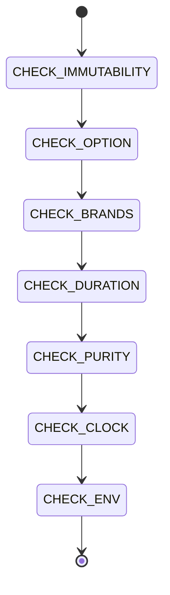

# Functional Invariants

```yaml
module_id: ETS-07
domain: functional_correctness
inputs: [ChangeSetBundle, ServiceDefinitions]
outputs: [Finding[]]
```

## Review Protocol



## Immutability

All data inside `Effect.gen` blocks must be immutable.

```yaml
assertions:
  ETS-07-001:
    predicate: "No `let` inside Effect.gen blocks — use `const` + pipe/spread"
    on_fail:
      severity: BLOCKER
      remediation: |
        WRONG:
          let result = '';
          if (cond) result = 'a';
          else result = 'b';

        CORRECT:
          const result = cond ? 'a' : 'b';

        For accumulation:
          const items = yield* Effect.forEach(inputs, (x) => process(x));

  ETS-07-002:
    predicate: "No .push() mutation — use spread, ReadonlyArray.append, or build via pipe"
    on_fail:
      severity: MAJOR
      remediation: |
        WRONG:
          const arr: string[] = [];
          arr.push('a');

        CORRECT:
          const arr = [...existing, 'a'];

        Or build arrays functionally:
          const result = yield* Effect.forEach(items, (item) =>
            Effect.gen(function* () { /* ... */ })
          );

        Exception: mutable arrays are acceptable in Node.js callback handlers
        (e.g., container stdout accumulation in Effect.async) where immutable
        alternatives would be impractical.
```

## Option Monad

Nullable returns use `Option<T>` in Effect service methods. Legacy wrappers unwrap to `T | undefined` or `T | null`.

```yaml
assertions:
  ETS-07-003:
    predicate: "Nullable returns in Effect service methods use Option<T>"
    on_fail:
      severity: MAJOR
      remediation: |
        WRONG (in service shape):
          readonly getTaskById: (id: string) => Effect.Effect<Task | undefined, Error>;

        CORRECT (in service shape):
          readonly getTaskById: (id: string) => Effect.Effect<Option<Task>, Error>;

        At call sites:
          const task = yield* service.getTaskById(id);
          const name = Option.getOrElse(task, () => defaultTask);
          // or
          if (Option.isSome(task)) { /* task.value */ }

        Legacy wrapper unwraps:
          export function getTaskById(id: string): Task | undefined {
            const opt = Effect.runSync(legacyService.getTaskById(id));
            return Option.getOrUndefined(opt);
          }
```

## Brand Types

Domain identity strings use `Schema.brand` to prevent confusion at compile time.

```yaml
assertions:
  ETS-07-004:
    predicate: "Domain identity strings use Schema.brand branded types"
    on_fail:
      severity: MAJOR
      remediation: |
        Define in src/schemas.ts:
          export const TaskId = Schema.String.pipe(Schema.brand("TaskId"));
          export type TaskId = typeof TaskId.Type;

        Use in schema fields:
          id: TaskId,

        Create values:
          const id = TaskId.make("task-123");

        At DB boundary (SQLite returns plain objects):
          Schema.decodeUnknownSync(ScheduledTask)(row)

        Current brands: TaskId
        Future brands (Phase 2): GroupFolder, ChatJid
```

## Duration

Time values use `Duration` from Effect — no raw millisecond magic numbers.

```yaml
assertions:
  ETS-07-005:
    predicate: "Time values use Duration — no raw millisecond magic numbers"
    on_fail:
      severity: MINOR
      remediation: |
        WRONG:
          const timeout = 300000;
          const poll = 2000;

        CORRECT:
          import { Duration } from 'effect';
          const timeout = Duration.minutes(5);
          const poll = Duration.millis(2000);

        In AppConfig, Duration fields coexist with numeric fields
        during migration (legacy wrappers use the numeric fields).

        Use Duration fields in Effect code:
          yield* Effect.sleep(config.pollIntervalDuration);
          Effect.timeoutFail({ duration: config.containerTimeoutDuration, ... });
```

## Purity Boundary

Functions are either provably pure OR return `Effect<>`. No impure helpers that look pure.

```yaml
assertions:
  ETS-07-006:
    predicate: "Functions are either provably pure OR return Effect<>"
    on_fail:
      severity: BLOCKER
      remediation: |
        A function is pure if it:
        - Takes only its arguments as input (no process.env, no fs, no Date)
        - Returns a deterministic value
        - Has no side effects

        WRONG (impure but looks pure):
          function getRealPath(p: string): string | null {
            try { return fs.realpathSync(p); } catch { return null; }
          }

        CORRECT (explicitly effectful):
          const getRealPath = (p: string) =>
            fileSystem.realPath(p).pipe(Effect.option);

        Pure helpers (string manipulation, math, path joining) stay as
        plain functions. I/O helpers become Effect functions.
```

## Clock Discipline

No `Date.now()` or `new Date()` outside `Effect.sync` blocks. Services use `Clock.currentTimeMillis`.

```yaml
assertions:
  ETS-07-007:
    predicate: "No Date.now() / new Date() outside Effect.sync — use Clock.currentTimeMillis in services"
    on_fail:
      severity: MAJOR
      remediation: |
        WRONG:
          const now = new Date().toISOString();

        CORRECT:
          import { Clock } from 'effect';
          const nowMs = yield* Clock.currentTimeMillis;
          const now = new Date(Number(nowMs)).toISOString();

        Exception: Inside Node.js callback handlers (Effect.async close handlers)
        where yielding is not possible — use Date directly there but document why.

        Exception: Legacy wrappers that use Effect.runSync — Clock is
        automatically provided by the default runtime.
```

## Environment Reads

`process.env` reads only in `AppConfig` or Layer construction.

```yaml
assertions:
  ETS-07-008:
    predicate: "process.env reads only in AppConfig or Layer construction"
    on_fail:
      severity: MAJOR
      remediation: |
        WRONG:
          function getEnvVar(name: string): string | undefined {
            return process.env[name];
          }

        CORRECT:
          // In AppConfig:
          readonly apiKey: string;
          // ...
          apiKey: process.env.ELEVENLABS_API_KEY || '',

          // In service code:
          const config = yield* AppConfig;
          const apiKey = config.apiKey;
```
