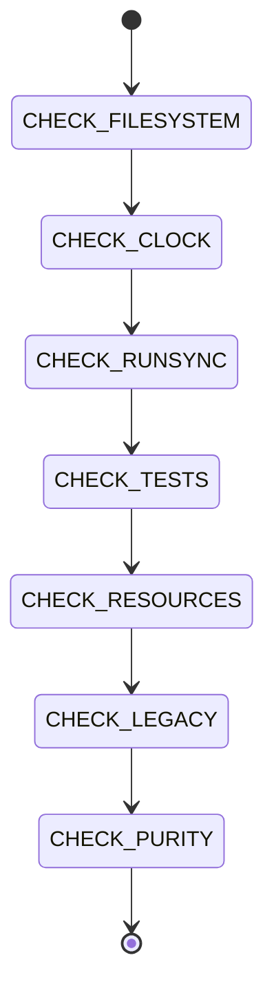

# Hexagonal Architecture

```yaml
module_id: ETS-08
domain: architecture
inputs: [ChangeSetBundle, ServiceDefinitions, LayerGraph]
outputs: [Finding[]]
```

## Review Protocol



## Port: FileSystem

Services access the filesystem via `yield* FileSystem` from `@effect/platform`, not `import fs`.

```yaml
assertions:
  ETS-08-001:
    predicate: "Services access filesystem via yield* FileSystem (@effect/platform), not import fs"
    on_fail:
      severity: BLOCKER
      remediation: |
        WRONG:
          import fs from 'fs';
          fs.existsSync(path);
          fs.readFileSync(path, 'utf-8');

        CORRECT:
          import { FileSystem } from '@effect/platform/FileSystem';

          const makeFooService = Effect.gen(function* () {
            const fileSystem = yield* FileSystem;

            const loadFile = (path: string) =>
              Effect.gen(function* () {
                const content = yield* fileSystem.readFileString(path);
                return content;
              });
          });

        Method mapping:
          fs.existsSync(p)           → yield* fileSystem.exists(p)
          fs.readFileSync(p, 'utf-8') → yield* fileSystem.readFileString(p)
          fs.writeFileSync(p, data)   → yield* fileSystem.writeFileString(p, data)
          fs.mkdirSync(p, {recursive}) → yield* fileSystem.makeDirectory(p, {recursive: true})
          fs.realpathSync(p)          → yield* fileSystem.realPath(p)
          fs.renameSync(old, new)     → yield* fileSystem.rename(old, new)
          fs.readdirSync(p)           → yield* fileSystem.readDirectory(p)

        Error mapping — PlatformError → domain errors:
          yield* fileSystem.readFileString(path).pipe(
            Effect.mapError((e) => new FileReadError({
              path, message: e.message, cause: e
            })),
          );
```

## Port: Clock

Services access time via `Clock.currentTimeMillis`, not `Date.now()`.

```yaml
assertions:
  ETS-08-002:
    predicate: "Services access time via Clock.currentTimeMillis, not Date.now()"
    on_fail:
      severity: MAJOR
      remediation: |
        WRONG:
          const now = Date.now();
          const iso = new Date().toISOString();

        CORRECT:
          import { Clock } from 'effect';
          const nowMs = yield* Clock.currentTimeMillis;
          const iso = new Date(Number(nowMs)).toISOString();

        Clock is provided by the default Effect runtime (no extra Layer needed).
        Tests provide TestClock for deterministic timestamps.
```

## No Module-Scope Effect.run

No `Effect.runSync` / `Effect.runPromise` at module scope except in legacy wrappers.

```yaml
assertions:
  ETS-08-003:
    predicate: "No Effect.runSync/runPromise at module scope except legacy wrappers"
    on_fail:
      severity: BLOCKER
      remediation: |
        WRONG (non-legacy):
          const data = Effect.runSync(loadConfig);

        CORRECT:
          // Defer to Layer construction or caller

        Legacy wrappers (migration-phase only) are the sole exception:
          const legacyService = Effect.runSync(
            makeFooService.pipe(Effect.provide(BunFileSystem.layer))
          );
```

## Test Layer Injection

Tests provide `TestFileSystem` / `TestClock` layers — no `vi.mock('fs')`.

```yaml
assertions:
  ETS-08-004:
    predicate: "Tests provide TestFileSystem / TestClock layers, not vi.mock('fs')"
    on_fail:
      severity: MAJOR
      remediation: |
        WRONG:
          vi.mock('fs', async () => { ... });

        CORRECT:
          import { makeTestFileSystem } from './helpers/TestFileSystem.js';
          import { makeTestClock } from './helpers/TestClock.js';

          const testLayers = Layer.merge(
            makeTestFileSystem({
              '/path/to/file.json': '{"key": "value"}',
            }),
            makeTestClock(1706745600000),
          );

          const result = Effect.runSync(
            program.pipe(
              Effect.provide(Layer.merge(FooServiceLive, testLayers)),
            ),
          );

        Benefits:
        - No vi.mock hoisting issues
        - Type-safe: FileSystem interface enforced
        - Composable: merge multiple test layers
        - Deterministic: TestClock freezes time
```

## Resource Lifecycle

Resource lifecycle (containers, file handles) uses `Effect.acquireRelease`.

```yaml
assertions:
  ETS-08-005:
    predicate: "Resource lifecycle uses Effect.acquireRelease"
    on_fail:
      severity: MAJOR
      remediation: |
        For resources that need cleanup:
          const managed = Effect.acquireRelease(
            acquire,   // Effect that creates the resource
            (resource) => cleanup(resource).pipe(Effect.orDie),
          );

        Container spawn is an exception — it uses Effect.async with a cleanup
        return value, which is the equivalent pattern for callback-based APIs.
```

## Legacy Wrapper Layers

Legacy wrappers provide `BunFileSystem.layer` internally so callers don't need to.

```yaml
assertions:
  ETS-08-006:
    predicate: "Legacy wrappers provide BunFileSystem.layer internally"
    on_fail:
      severity: BLOCKER
      remediation: |
        CORRECT:
          import { BunFileSystem } from '@effect/platform-bun/BunFileSystem';

          const legacyService = Effect.runSync(
            makeMountSecurityService.pipe(
              Effect.provide(BunFileSystem.layer),
            ),
          );

        BunFileSystem.layer is Layer<FileSystem> with no Scope requirement,
        so Effect.runSync works for synchronous services.

        For async services (PhoneCallerService), use Effect.runPromise
        with the same pattern.
```

## Pure Helper Migration

Pure helpers needing I/O are refactored into `Effect.gen` or accept port as parameter.

```yaml
assertions:
  ETS-08-007:
    predicate: "Pure helpers needing I/O are refactored into Effect.gen or accept port as parameter"
    on_fail:
      severity: MAJOR
      remediation: |
        WRONG (helper that secretly does I/O):
          function expandPath(p: string): string {
            const homeDir = process.env.HOME || '/Users/user';
            return p.startsWith('~/') ? path.join(homeDir, p.slice(2)) : path.resolve(p);
          }

        CORRECT (pure — takes homeDir as parameter):
          function expandPath(p: string, homeDir: string): string {
            return p.startsWith('~/') ? path.join(homeDir, p.slice(2)) : path.resolve(p);
          }

        CORRECT (effectful — uses FileSystem):
          const getRealPath = (p: string) =>
            fileSystem.realPath(p).pipe(Effect.option);
```
